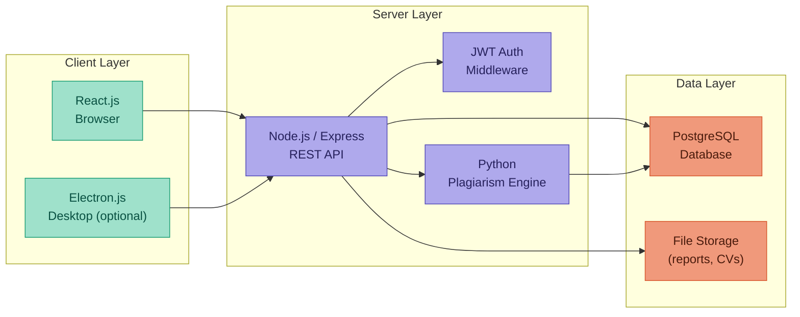

# ⚙️ Stack Technique

[[Index|← Back to Index]]

---

## Primary Stack

| Layer | Technology |
|---|---|
| Frontend | React.js |
| Backend | Node.js / Express |
| Database | PostgreSQL |
| Auth | JWT (JSON Web Token) |
| Plagiarism | Python / NLP (TF-IDF + cosine similarity) or external API |
| DevOps | Docker / Docker Compose |
| Version control | Git (GitHub) |
| IDE | VSCode |

---

## Alternatives / Extensions

| Use case | Alternative |
|---|---|
| Backend | Symfony (PHP) — strong MVC, ORM, security built-in |
| Desktop client for supervisor | Electron.js |
| Database | MySQL |

---

## Architecture Overview

---

## Security Decisions

- Files stored **outside** the public web root — never accessible by direct URL
- All routes protected by JWT middleware
- RBAC enforced at API level, not just UI level
- Passwords hashed with bcrypt
- Plagiarism runs as an **async background job** to avoid blocking the UI
