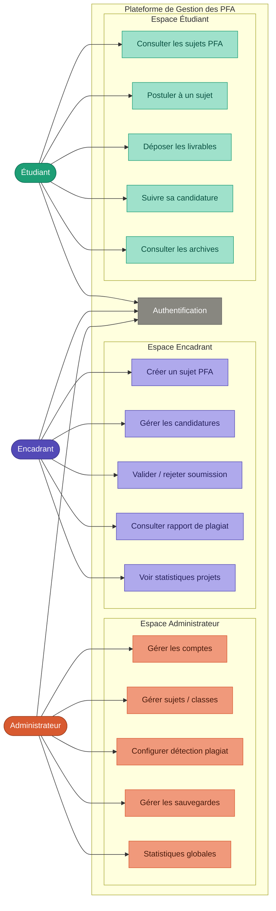

# 📊 Diagramme de Cas d'Utilisation

[[Index|← Back to Index]]

---

```mermaid
flowchart LR
    Etudiant(["Étudiant"]):::actorEtu
    Encadrant(["Encadrant"]):::actorEnc
    Admin(["Administrateur"]):::actorAdm

    subgraph PFA ["Plateforme de Gestion des PFA"]
      AUTH["Authentification"]:::shared

      subgraph UC_ADM ["Espace Administrateur"]
        direction LR
        A1["Gérer les comptes"]:::adm
        A2["Gérer sujets / classes"]:::adm
        A3["Configurer détection plagiat"]:::adm
        A4["Gérer les sauvegardes"]:::adm
        A5["Statistiques globales"]:::adm
      end

      subgraph UC_ENC ["Espace Encadrant"]
        direction LR
        EN1["Créer un sujet PFA"]:::enc
        EN2["Gérer les candidatures"]:::enc
        EN3["Valider / rejeter soumission"]:::enc
        EN4["Consulter rapport de plagiat"]:::enc
        EN5["Voir statistiques projets"]:::enc
      end

      subgraph UC_ETU ["Espace Étudiant"]
        direction LR
        E1["Consulter les sujets PFA"]:::etu
        E2["Postuler à un sujet"]:::etu
        E3["Déposer les livrables"]:::etu
        E4["Suivre sa candidature"]:::etu
        E5["Consulter les archives"]:::etu
      end
    end

    Admin --> AUTH
    Encadrant --> AUTH
    Etudiant --> AUTH

    Admin --> A1
    Admin --> A2
    Admin --> A3
    Admin --> A4
    Admin --> A5

    Encadrant --> EN1
    Encadrant --> EN2
    Encadrant --> EN3
    Encadrant --> EN4
    Encadrant --> EN5

    Etudiant --> E1
    Etudiant --> E2
    Etudiant --> E3
    Etudiant --> E4
    Etudiant --> E5

    classDef actorEtu fill:#1D9E75,stroke:#0F6E56,color:#fff
    classDef actorEnc fill:#534AB7,stroke:#3C3489,color:#fff
    classDef actorAdm fill:#D85A30,stroke:#993C1D,color:#fff
    classDef shared fill:#888780,stroke:#5F5E5A,color:#fff
    classDef etu fill:#9FE1CB,stroke:#1D9E75,color:#085041
    classDef enc fill:#AFA9EC,stroke:#534AB7,color:#26215C
    classDef adm fill:#F0997B,stroke:#D85A30,color:#4A1B0C
```
