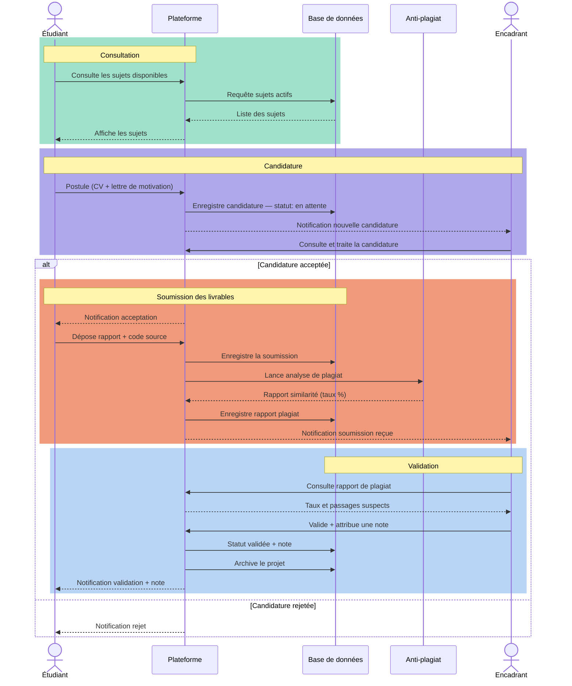

# 🔄 Diagramme de Séquence — Candidature

[[Index|← Back to Index]]

---

```mermaid
sequenceDiagram
    actor E as Étudiant
    participant P as Plateforme
    participant DB as Base de données
    participant AI as Anti-plagiat
    actor EN as Encadrant

    rect rgb(159, 225, 203)
      note over E,P: Consultation
      E->>P: Consulte les sujets disponibles
      P->>DB: Requête sujets actifs
      DB-->>P: Liste des sujets
      P-->>E: Affiche les sujets
    end

    rect rgb(175, 169, 236)
      note over E,EN: Candidature
      E->>P: Postule (CV + lettre de motivation)
      P->>DB: Enregistre candidature — statut: en attente
      P-->>EN: Notification nouvelle candidature
      EN->>P: Consulte et traite la candidature
    end

    alt Candidature acceptée
      rect rgb(240, 153, 123)
        note over E,DB: Soumission des livrables
        P-->>E: Notification acceptation
        E->>P: Dépose rapport + code source
        P->>DB: Enregistre la soumission
        P->>AI: Lance analyse de plagiat
        AI-->>P: Rapport similarité (taux %)
        P->>DB: Enregistre rapport plagiat
        P-->>EN: Notification soumission reçue
      end

      rect rgb(185, 213, 245)
        note over EN,DB: Validation
        EN->>P: Consulte rapport de plagiat
        P-->>EN: Taux et passages suspects
        EN->>P: Valide + attribue une note
        P->>DB: Statut validée + note
        P->>DB: Archive le projet
        P-->>E: Notification validation + note
      end

    else Candidature rejetée
      P-->>E: Notification rejet
    end
```
