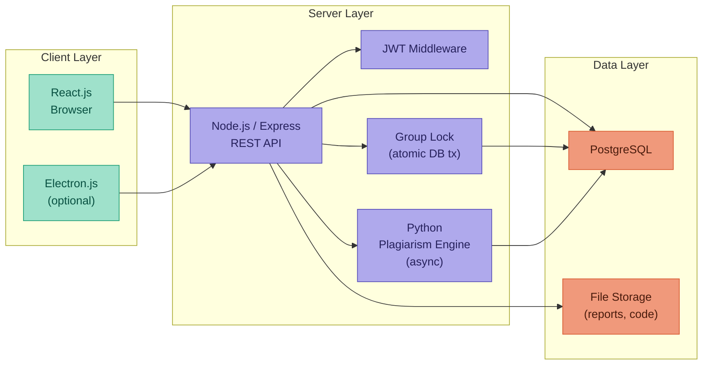

# ⚙️ Stack Technique

[← Back to Index](../index.md)

---

## Primary Stack

| Layer | Technology |
|---|---|
| Frontend | React.js |
| Backend | Node.js / Express |
| Database | PostgreSQL |
| Auth | JWT (JSON Web Token) |
| Plagiarism | Python / NLP (TF-IDF + cosine similarity) or external API |
| DevOps | Docker / Docker Compose |
| Version control | Git (GitHub) |
| IDE | VSCode |

---

## Alternatives / Extensions

| Use case | Alternative |
|---|---|
| Backend | Symfony (PHP) |
| Desktop client for teacher | Electron.js |
| Database | MySQL |

---

## Key Technical Decisions

### Group submission lock
The group submission lock (`VerrouGroupe`) must be handled **atomically at the database level** to prevent race conditions (two students submitting at the exact same time). This is done with a database transaction + unique constraint on `(espaceId)` in the `VerrouGroupe` table.

```sql
-- Only one lock per space allowed
ALTER TABLE verrou_groupe ADD CONSTRAINT unique_espace UNIQUE (espace_id);
```

### Plagiarism async job
Plagiarism analysis runs as a **background job** after upload to avoid blocking the UI. The submission is saved immediately with status `EN_ANALYSE`, then updated to `EN_ATTENTE` once the report is ready.

---

## Architecture Overview


