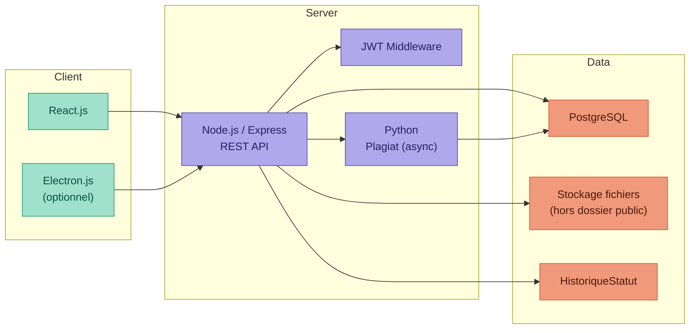

# ⚙️ Stack Technique

[← Retour à l'accueil](../index.md)

## Stack principale

| Couche | Technologie |
|---|---|
| Frontend | React.js |
| Backend | Node.js / Express |
| Base de données | PostgreSQL |
| Auth | JWT (JSON Web Token) |
| Détection plagiat | Python / NLP (TF-IDF + similarité cosinus) |
| DevOps | Docker / Docker Compose |
| Versioning | Git (GitHub) |
| IDE | VSCode |

## Alternatives

| Cas | Alternative |
|---|---|
| Backend | Symfony (PHP) |
| Client desktop enseignant | Electron.js |
| BDD | MySQL |

## Décisions techniques clés

### Unicité du titre par classe
Contrainte unique composite en base :
```sql
ALTER TABLE sujet ADD CONSTRAINT unique_titre_classe UNIQUE (titre, classe_academique_id);
```

### Rôle responsable de groupe
Le responsable est désigné par l'enseignant et stocké dans `MembreGroupe.estResponsable`. La vérification se fait côté serveur avant tout dépôt.

### Statut de soumission modifiable
Un historique des changements de statut est conservé dans une table `HistoriqueStatut` pour la traçabilité.

### Plagiat asynchrone
L'analyse de plagiat est une tâche de fond. La soumission passe par les statuts : `EN_ANALYSE` → `EN_ATTENTE` (prête pour révision enseignant).

## Architecture


```mermaid
flowchart LR
    subgraph Client
        Browser["React.js"]:::fe
        Desktop["Electron.js\n(optionnel)"]:::fe
    end
    subgraph Server
        API["Node.js / Express\nREST API"]:::be
        Auth["JWT Middleware"]:::be
        Plagiarism["Python\nPlagiat (async)"]:::be
    end
    subgraph Data
        DB["PostgreSQL"]:::db
        Files["Stockage fichiers\n(hors dossier public)"]:::db
        History["HistoriqueStatut"]:::db
    end

    Browser --> API
    Desktop --> API
    API --> Auth
    API --> DB
    API --> Files
    API --> Plagiarism
    Plagiarism --> DB
    API --> History

    classDef fe fill:#9FE1CB,stroke:#1D9E75,color:#085041
    classDef be fill:#AFA9EC,stroke:#534AB7,color:#26215C
    classDef db fill:#F0997B,stroke:#D85A30,color:#4A1B0C
```
