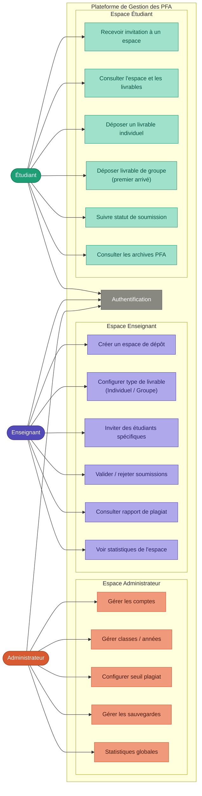

# 📊 Diagramme de Cas d'Utilisation

[← Back to Index](../index.md)

---

```mermaid
flowchart LR
    Teacher(["Enseignant"]):::actorEnc
    Student(["Étudiant"]):::actorEtu
    Admin(["Administrateur"]):::actorAdm

    subgraph PFA ["Plateforme de Gestion des PFA"]
      AUTH["Authentification"]:::shared

      subgraph UC_ADM ["Espace Administrateur"]
        direction LR
        A1["Gérer les comptes"]:::adm
        A2["Gérer classes / années"]:::adm
        A3["Configurer seuil plagiat"]:::adm
        A4["Gérer les sauvegardes"]:::adm
        A5["Statistiques globales"]:::adm
      end

      subgraph UC_ENC ["Espace Enseignant"]
        direction LR
        EN1["Créer un espace de dépôt"]:::enc
        EN2["Configurer type de livrable\n(Individuel / Groupe)"]:::enc
        EN3["Inviter des étudiants spécifiques"]:::enc
        EN4["Valider / rejeter soumissions"]:::enc
        EN5["Consulter rapport de plagiat"]:::enc
        EN6["Voir statistiques de l'espace"]:::enc
      end

      subgraph UC_ETU ["Espace Étudiant"]
        direction LR
        E1["Recevoir invitation à un espace"]:::etu
        E2["Consulter l'espace et les livrables"]:::etu
        E3["Déposer un livrable individuel"]:::etu
        E4["Déposer livrable de groupe\n(premier arrivé)"]:::etu
        E5["Suivre statut de soumission"]:::etu
        E6["Consulter les archives PFA"]:::etu
      end
    end

    Admin --> AUTH
    Teacher --> AUTH
    Student --> AUTH

    Admin --> A1
    Admin --> A2
    Admin --> A3
    Admin --> A4
    Admin --> A5

    Teacher --> EN1
    Teacher --> EN2
    Teacher --> EN3
    Teacher --> EN4
    Teacher --> EN5
    Teacher --> EN6

    Student --> E1
    Student --> E2
    Student --> E3
    Student --> E4
    Student --> E5
    Student --> E6

    classDef actorEtu fill:#1D9E75,stroke:#0F6E56,color:#fff
    classDef actorEnc fill:#534AB7,stroke:#3C3489,color:#fff
    classDef actorAdm fill:#D85A30,stroke:#993C1D,color:#fff
    classDef shared fill:#888780,stroke:#5F5E5A,color:#fff
    classDef etu fill:#9FE1CB,stroke:#1D9E75,color:#085041
    classDef enc fill:#AFA9EC,stroke:#534AB7,color:#26215C
    classDef adm fill:#F0997B,stroke:#D85A30,color:#4A1B0C
```
