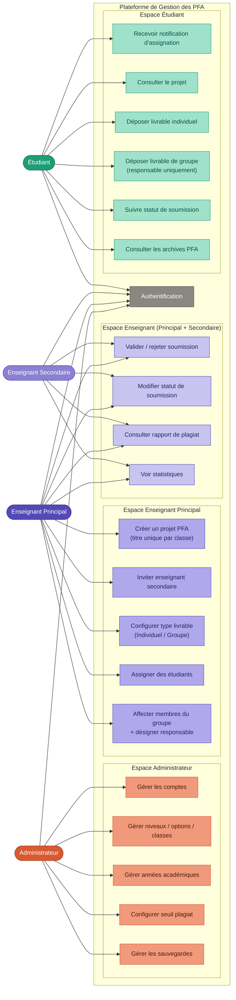

# 📊 Diagramme de Cas d'Utilisation

[← Retour à l'accueil](../index.md)

```mermaid
flowchart LR
    EnsP(["Enseignant Principal"]):::actorEnc
    EnsS(["Enseignant Secondaire"]):::actorEnc2
    Etu(["Étudiant"]):::actorEtu
    Admin(["Administrateur"]):::actorAdm

    subgraph PFA ["Plateforme de Gestion des PFA"]
      AUTH["Authentification"]:::shared

      subgraph UC_ADM ["Espace Administrateur"]
        direction LR
        A1["Gérer les comptes"]:::adm
        A2["Gérer niveaux / options / classes"]:::adm
        A3["Gérer années académiques"]:::adm
        A4["Configurer seuil plagiat"]:::adm
        A5["Gérer les sauvegardes"]:::adm
      end

      subgraph UC_ENSP ["Espace Enseignant Principal"]
        direction LR
        EP1["Créer un projet PFA\n(titre unique par classe)"]:::enc
        EP2["Inviter enseignant secondaire"]:::enc
        EP3["Configurer type livrable\n(Individuel / Groupe)"]:::enc
        EP4["Assigner des étudiants"]:::enc
        EP5["Affecter membres du groupe\n+ désigner responsable"]:::enc
      end

      subgraph UC_SHARED ["Espace Enseignant (Principal + Secondaire)"]
        direction LR
        ES1["Valider / rejeter soumission"]:::enc2
        ES2["Modifier statut de soumission"]:::enc2
        ES3["Consulter rapport de plagiat"]:::enc2
        ES4["Voir statistiques"]:::enc2
      end

      subgraph UC_ETU ["Espace Étudiant"]
        direction LR
        E1["Recevoir notification d'assignation"]:::etu
        E2["Consulter le projet"]:::etu
        E3["Déposer livrable individuel"]:::etu
        E4["Déposer livrable de groupe\n(responsable uniquement)"]:::etu
        E5["Suivre statut de soumission"]:::etu
        E6["Consulter les archives PFA"]:::etu
      end
    end

    Admin --> AUTH
    EnsP --> AUTH
    EnsS --> AUTH
    Etu --> AUTH

    Admin --> A1
    Admin --> A2
    Admin --> A3
    Admin --> A4
    Admin --> A5

    EnsP --> EP1
    EnsP --> EP2
    EnsP --> EP3
    EnsP --> EP4
    EnsP --> EP5

    EnsP --> ES1
    EnsP --> ES2
    EnsP --> ES3
    EnsP --> ES4

    EnsS --> ES1
    EnsS --> ES2
    EnsS --> ES3
    EnsS --> ES4

    Etu --> E1
    Etu --> E2
    Etu --> E3
    Etu --> E4
    Etu --> E5
    Etu --> E6

    classDef actorEtu fill:#1D9E75,stroke:#0F6E56,color:#fff
    classDef actorEnc fill:#534AB7,stroke:#3C3489,color:#fff
    classDef actorEnc2 fill:#8B80D1,stroke:#534AB7,color:#fff
    classDef actorAdm fill:#D85A30,stroke:#993C1D,color:#fff
    classDef shared fill:#888780,stroke:#5F5E5A,color:#fff
    classDef etu fill:#9FE1CB,stroke:#1D9E75,color:#085041
    classDef enc fill:#AFA9EC,stroke:#534AB7,color:#26215C
    classDef enc2 fill:#C8C4F0,stroke:#534AB7,color:#26215C
    classDef adm fill:#F0997B,stroke:#D85A30,color:#4A1B0C
```
