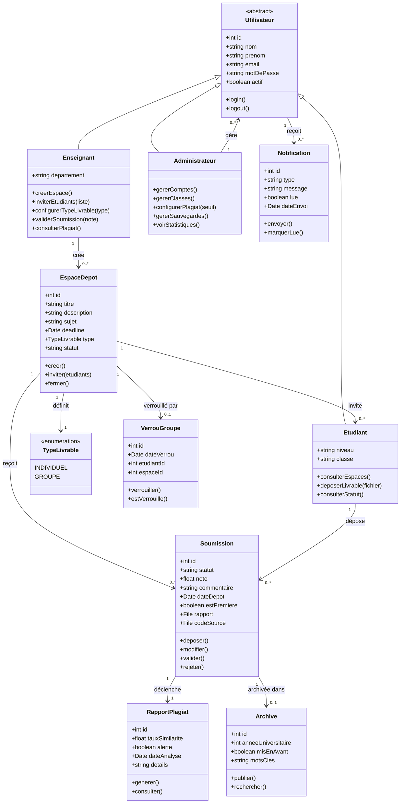

# 🗂️ Diagramme de Classes

[← Back to Index](../index.md)

---

```mermaid
classDiagram
    direction TB

    class Utilisateur {
      <<abstract>>
      +int id
      +string nom
      +string prenom
      +string email
      +string motDePasse
      +boolean actif
      +login()
      +logout()
    }

    class Etudiant {
      +string niveau
      +string classe
      +consulterEspaces()
      +deposerLivrable(fichier)
      +consulterStatut()
    }

    class Enseignant {
      +string departement
      +creerEspace()
      +inviterEtudiants(liste)
      +configurerTypeLivrable(type)
      +validerSoumission(note)
      +consulterPlagiat()
    }

    class Administrateur {
      +gererComptes()
      +gererClasses()
      +configurerPlagiat(seuil)
      +gererSauvegardes()
      +voirStatistiques()
    }

    class EspaceDepot {
      +int id
      +string titre
      +string description
      +string sujet
      +Date deadline
      +TypeLivrable type
      +string statut
      +creer()
      +inviter(etudiants)
      +fermer()
    }

    class TypeLivrable {
      <<enumeration>>
      INDIVIDUEL
      GROUPE
    }

    class Soumission {
      +int id
      +string statut
      +float note
      +string commentaire
      +Date dateDepot
      +boolean estPremiere
      +File rapport
      +File codeSource
      +deposer()
      +modifier()
      +valider()
      +rejeter()
    }

    class VerrouGroupe {
      +int id
      +Date dateVerrou
      +int etudiantId
      +int espaceId
      +verrouiller()
      +estVerrouille()
    }

    class Notification {
      +int id
      +string type
      +string message
      +boolean lue
      +Date dateEnvoi
      +envoyer()
      +marquerLue()
    }

    class RapportPlagiat {
      +int id
      +float tauxSimilarite
      +boolean alerte
      +Date dateAnalyse
      +string details
      +generer()
      +consulter()
    }

    class Archive {
      +int id
      +int anneeUniversitaire
      +boolean misEnAvant
      +string motsCles
      +publier()
      +rechercher()
    }

    Utilisateur <|-- Etudiant
    Utilisateur <|-- Enseignant
    Utilisateur <|-- Administrateur

    Enseignant "1" --> "0..*" EspaceDepot : crée
    EspaceDepot "1" --> "1" TypeLivrable : définit
    EspaceDepot "1" --> "0..*" Etudiant : invite
    EspaceDepot "1" --> "0..*" Soumission : reçoit
    EspaceDepot "1" --> "0..1" VerrouGroupe : verrouillé par

    Etudiant "1" --> "0..*" Soumission : dépose
    Soumission "1" --> "1" RapportPlagiat : déclenche
    Soumission "1" --> "0..1" Archive : archivée dans

    Utilisateur "1" --> "0..*" Notification : reçoit
    Administrateur "1" --> "0..*" Utilisateur : gère
```
