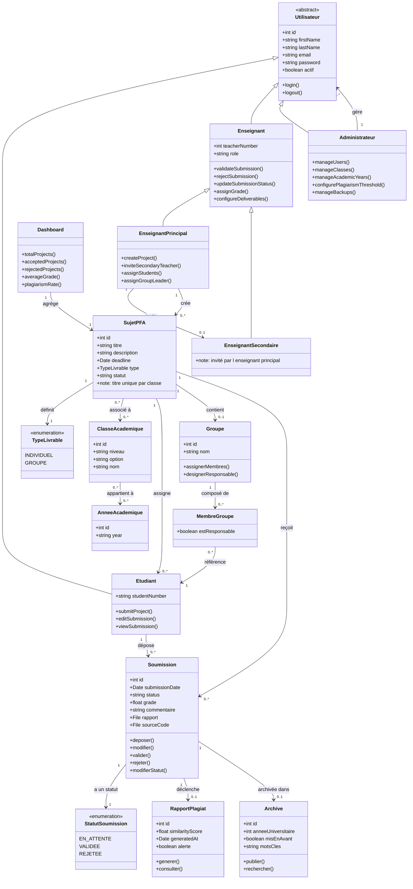

# 🗂️ Diagramme de Classes

[← Retour à l'accueil](../index.md)

```mermaid
classDiagram
    direction TB

    class Utilisateur {
      <<abstract>>
      +int id
      +string firstName
      +string lastName
      +string email
      +string password
      +boolean actif
      +login()
      +logout()
    }

    class Etudiant {
      +string studentNumber
      +submitProject()
      +editSubmission()
      +viewSubmission()
    }

    class Enseignant {
      +int teacherNumber
      +string role
      +validateSubmission()
      +rejectSubmission()
      +updateSubmissionStatus()
      +assignGrade()
      +configureDeliverables()
    }

    class EnseignantPrincipal {
      +createProject()
      +inviteSecondaryTeacher()
      +assignStudents()
      +assignGroupLeader()
    }

    class EnseignantSecondaire {
      +note: invité par l enseignant principal
    }

    class Administrateur {
      +manageUsers()
      +manageClasses()
      +manageAcademicYears()
      +configurePlagiarismThreshold()
      +manageBackups()
    }

    class ClasseAcademique {
      +int id
      +string niveau
      +string option
      +string nom
    }

    class AnneeAcademique {
      +int id
      +string year
    }

    class SujetPFA {
      +int id
      +string titre
      +string description
      +Date deadline
      +TypeLivrable type
      +string statut
      +note: titre unique par classe
    }

    class TypeLivrable {
      <<enumeration>>
      INDIVIDUEL
      GROUPE
    }

    class Groupe {
      +int id
      +string nom
      +assignerMembres()
      +designerResponsable()
    }

    class MembreGroupe {
      +boolean estResponsable
    }

    class Soumission {
      +int id
      +Date submissionDate
      +string status
      +float grade
      +string commentaire
      +File rapport
      +File sourceCode
      +deposer()
      +modifier()
      +valider()
      +rejeter()
      +modifierStatut()
    }

    class StatutSoumission {
      <<enumeration>>
      EN_ATTENTE
      VALIDEE
      REJETEE
    }

    class RapportPlagiat {
      +int id
      +float similarityScore
      +Date generatedAt
      +boolean alerte
      +generer()
      +consulter()
    }

    class Archive {
      +int id
      +int anneeUniversitaire
      +boolean misEnAvant
      +string motsCles
      +publier()
      +rechercher()
    }

    class Dashboard {
      +totalProjects()
      +acceptedProjects()
      +rejectedProjects()
      +averageGrade()
      +plagiarismRate()
    }

    Utilisateur <|-- Etudiant
    Utilisateur <|-- Enseignant
    Utilisateur <|-- Administrateur
    Enseignant <|-- EnseignantPrincipal
    Enseignant <|-- EnseignantSecondaire

    EnseignantPrincipal "1" --> "0..1" EnseignantSecondaire : invite
    EnseignantPrincipal "1" --> "0..*" SujetPFA : crée
    SujetPFA "1" --> "1" TypeLivrable : définit
    SujetPFA "0..*" --> "0..*" ClasseAcademique : associé à
    ClasseAcademique "0..*" --> "0..*" AnneeAcademique : appartient à

    SujetPFA "1" --> "0..*" Etudiant : assigne
    SujetPFA "1" --> "0..1" Groupe : contient
    Groupe "1" --> "0..*" MembreGroupe : composé de
    MembreGroupe "0..*" --> "1" Etudiant : référence

    SujetPFA "1" --> "0..*" Soumission : reçoit
    Etudiant "1" --> "0..*" Soumission : dépose
    Soumission "1" --> "1" StatutSoumission : a un statut
    Soumission "1" --> "0..1" RapportPlagiat : déclenche
    Soumission "1" --> "0..1" Archive : archivée dans

    Administrateur "1" --> "0..*" Utilisateur : gère
    Dashboard "1" --> "1" SujetPFA : agrège
```
