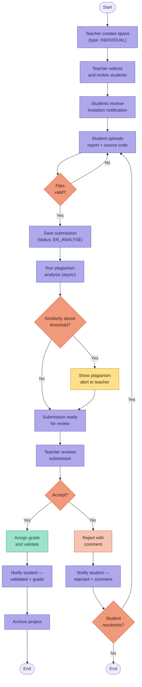

# 🔄 Diagrammes d'Activités

[← Back to Index](../index.md)

---

## Activité 1 — Dépôt Individuel

```mermaid
flowchart TD
    S([Start]) --> CreateSpace

    CreateSpace["Teacher creates space\n(type: INDIVIDUAL)"]:::action
    CreateSpace --> InviteStudents["Teacher selects\nand invites students"]:::action
    InviteStudents --> Notify["Students receive\ninvitation notification"]:::action
    Notify --> Upload["Student uploads\nreport + source code"]:::action
    Upload --> ValidFiles{Files\nvalid?}:::decision

    ValidFiles -->|No| Upload
    ValidFiles -->|Yes| SaveSubmission["Save submission\n(status: EN_ANALYSE)"]:::action
    SaveSubmission --> RunPlagiarism["Run plagiarism\nanalysis (async)"]:::action
    RunPlagiarism --> PlagResult{Similarity above\nthreshold?}:::decision

    PlagResult -->|Yes| AlertTeacher["Show plagiarism\nalert to teacher"]:::alert
    PlagResult -->|No| ReadyReview["Submission ready\nfor review"]:::action
    AlertTeacher --> ReadyReview

    ReadyReview --> TeacherReview["Teacher reviews\nsubmission"]:::action
    TeacherReview --> Decision{Accept?}:::decision

    Decision -->|Yes| Grade["Assign grade\nand validate"]:::success
    Decision -->|No| Reject["Reject with\ncomment"]:::fail

    Grade --> NotifyAccept["Notify student —\nvalidated + grade"]:::action
    Reject --> NotifyReject["Notify student —\nrejected + comment"]:::action
    NotifyReject --> Resubmit{Student\nresubmits?}:::decision
    Resubmit -->|Yes| Upload
    Resubmit -->|No| E2([End])
    NotifyAccept --> Archive["Archive project"]:::action
    Archive --> E1([End])

    classDef action fill:#AFA9EC,stroke:#534AB7,color:#26215C
    classDef decision fill:#F0997B,stroke:#D85A30,color:#4A1B0C
    classDef success fill:#9FE1CB,stroke:#1D9E75,color:#085041
    classDef fail fill:#F5C4B3,stroke:#D85A30,color:#4A1B0C
    classDef alert fill:#FFE08A,stroke:#B8860B,color:#3B2A00
```

---

## Activité 2 — Dépôt de Groupe

```mermaid
flowchart TD
    S([Start]) --> CreateSpace

    CreateSpace["Teacher creates space\n(type: GROUP)"]:::action
    CreateSpace --> InviteStudents["Teacher selects\nand invites students"]:::action
    InviteStudents --> Notify["All students receive\ninvitation notification"]:::action
    Notify --> TrySubmit["A student attempts\nto submit"]:::action
    TrySubmit --> CheckLock{Space\nlocked?}:::decision

    CheckLock -->|Yes| BlockStudent["Block student\nfrom submitting"]:::fail
    BlockStudent --> NotifyBlocked["Notify student —\ngroup already submitted"]:::alert
    NotifyBlocked --> E_blocked([End])

    CheckLock -->|No| Upload["Student uploads\nreport + source code"]:::action
    Upload --> ValidFiles{Files\nvalid?}:::decision
    ValidFiles -->|No| Upload
    ValidFiles -->|Yes| AtomicLock["Lock space\n(VerrouGroupe — atomic)"]:::action
    AtomicLock --> SaveSubmission["Save submission\n(status: EN_ANALYSE)"]:::action
    SaveSubmission --> NotifyOthers["Notify remaining students —\ngroup submission done, blocked"]:::alert
    NotifyOthers --> RunPlagiarism["Run plagiarism\nanalysis (async)"]:::action
    RunPlagiarism --> PlagResult{Similarity above\nthreshold?}:::decision

    PlagResult -->|Yes| AlertTeacher["Show plagiarism\nalert to teacher"]:::alert2
    PlagResult -->|No| ReadyReview["Submission ready\nfor review"]:::action
    AlertTeacher --> ReadyReview

    ReadyReview --> TeacherReview["Teacher reviews\ngroup submission"]:::action
    TeacherReview --> Decision{Accept?}:::decision

    Decision -->|Yes| Grade["Assign grade\nto group"]:::success
    Decision -->|No| Reject["Reject with\ncomment"]:::fail

    Grade --> NotifyAll["Notify all group members —\nvalidated + grade"]:::action
    Reject --> NotifyReject["Notify all group members —\nrejected + comment"]:::action
    NotifyAll --> Archive["Archive project"]:::action
    Archive --> E1([End])
    NotifyReject --> E2([End])

    classDef action fill:#AFA9EC,stroke:#534AB7,color:#26215C
    classDef decision fill:#F0997B,stroke:#D85A30,color:#4A1B0C
    classDef success fill:#9FE1CB,stroke:#1D9E75,color:#085041
    classDef fail fill:#F5C4B3,stroke:#D85A30,color:#4A1B0C
    classDef alert fill:#FFE08A,stroke:#B8860B,color:#3B2A00
    classDef alert2 fill:#FFD0D0,stroke:#CC0000,color:#4A0000
```
