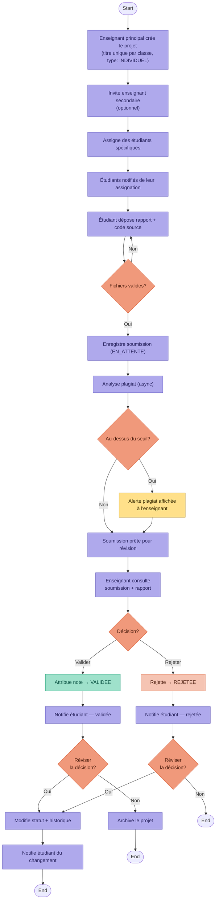
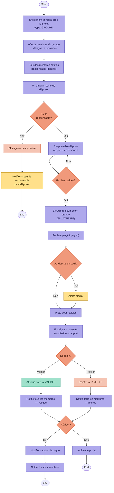

# 🔄 Diagrammes d'Activités

[← Retour à l'accueil](../index.md)

---

## Activité 1 — Dépôt Individuel

```mermaid
flowchart TD
    S([Start]) --> CreateProject

    CreateProject["Enseignant principal crée le projet\n(titre unique par classe, type: INDIVIDUEL)"]:::action
    CreateProject --> InviteSecondary["Invite enseignant secondaire\n(optionnel)"]:::action
    InviteSecondary --> AssignStudents["Assigne des étudiants spécifiques"]:::action
    AssignStudents --> NotifyStudents["Étudiants notifiés de leur assignation"]:::action
    NotifyStudents --> Upload["Étudiant dépose rapport + code source"]:::action
    Upload --> ValidFiles{Fichiers valides?}:::decision

    ValidFiles -->|Non| Upload
    ValidFiles -->|Oui| SaveSub["Enregistre soumission (EN_ATTENTE)"]:::action
    SaveSub --> RunPlagiarism["Analyse plagiat (async)"]:::action
    RunPlagiarism --> PlagResult{Au-dessus du seuil?}:::decision

    PlagResult -->|Oui| AlertTeacher["Alerte plagiat affichée\nà l'enseignant"]:::alert
    PlagResult -->|Non| ReadyReview["Soumission prête pour révision"]:::action
    AlertTeacher --> ReadyReview

    ReadyReview --> TeacherReview["Enseignant consulte\nsoumission + rapport"]:::action
    TeacherReview --> Decision{Décision?}:::decision

    Decision -->|Valider| Grade["Attribue note → VALIDEE"]:::success
    Decision -->|Rejeter| Reject["Rejette → REJETEE"]:::fail

    Grade --> NotifyAccept["Notifie étudiant — validée"]:::action
    Reject --> NotifyReject["Notifie étudiant — rejetée"]:::action

    NotifyAccept --> Revise1{Réviser\nla décision?}:::decision
    NotifyReject --> Revise2{Réviser\nla décision?}:::decision

    Revise1 -->|Oui| UpdateStatus["Modifie statut + historique"]:::action
    Revise2 -->|Oui| UpdateStatus
    UpdateStatus --> NotifyUpdate["Notifie étudiant du changement"]:::action
    NotifyUpdate --> E3([End])

    Revise1 -->|Non| Archive["Archive le projet"]:::action
    Revise2 -->|Non| E2([End])
    Archive --> E1([End])

    classDef action fill:#AFA9EC,stroke:#534AB7,color:#26215C
    classDef decision fill:#F0997B,stroke:#D85A30,color:#4A1B0C
    classDef success fill:#9FE1CB,stroke:#1D9E75,color:#085041
    classDef fail fill:#F5C4B3,stroke:#D85A30,color:#4A1B0C
    classDef alert fill:#FFE08A,stroke:#B8860B,color:#3B2A00
```

---

## Activité 2 — Dépôt de Groupe

```mermaid
flowchart TD
    S([Start]) --> CreateProject

    CreateProject["Enseignant principal crée le projet\n(type: GROUPE)"]:::action
    CreateProject --> AssignGroup["Affecte membres du groupe\n+ désigne responsable"]:::action
    AssignGroup --> NotifyAll["Tous les membres notifiés\n(responsable identifié)"]:::action
    NotifyAll --> TrySubmit["Un étudiant tente de déposer"]:::action
    TrySubmit --> IsLeader{Est le\nresponsable?}:::decision

    IsLeader -->|Non| BlockStudent["Blocage — pas autorisé"]:::fail
    BlockStudent --> NotifyBlocked["Notifie — seul le responsable\npeut déposer"]:::alert
    NotifyBlocked --> E_blocked([End])

    IsLeader -->|Oui| Upload["Responsable dépose\nrapport + code source"]:::action
    Upload --> ValidFiles{Fichiers valides?}:::decision
    ValidFiles -->|Non| Upload
    ValidFiles -->|Oui| SaveSub["Enregistre soumission groupe\n(EN_ATTENTE)"]:::action
    SaveSub --> RunPlagiarism["Analyse plagiat (async)"]:::action
    RunPlagiarism --> PlagResult{Au-dessus du seuil?}:::decision

    PlagResult -->|Oui| AlertTeacher["Alerte plagiat"]:::alert
    PlagResult -->|Non| ReadyReview["Prête pour révision"]:::action
    AlertTeacher --> ReadyReview

    ReadyReview --> TeacherReview["Enseignant consulte\nsoumission + rapport"]:::action
    TeacherReview --> Decision{Décision?}:::decision

    Decision -->|Valider| Grade["Attribue note → VALIDEE"]:::success
    Decision -->|Rejeter| Reject["Rejette → REJETEE"]:::fail

    Grade --> NotifyGroup1["Notifie tous les membres — validée"]:::action
    Reject --> NotifyGroup2["Notifie tous les membres — rejetée"]:::action

    NotifyGroup1 --> Revise{Réviser?}:::decision
    NotifyGroup2 --> Revise

    Revise -->|Oui| UpdateStatus["Modifie statut + historique"]:::action
    UpdateStatus --> NotifyUpdate["Notifie tous les membres"]:::action
    NotifyUpdate --> E3([End])

    Revise -->|Non| Archive["Archive le projet"]:::action
    Archive --> E1([End])

    classDef action fill:#AFA9EC,stroke:#534AB7,color:#26215C
    classDef decision fill:#F0997B,stroke:#D85A30,color:#4A1B0C
    classDef success fill:#9FE1CB,stroke:#1D9E75,color:#085041
    classDef fail fill:#F5C4B3,stroke:#D85A30,color:#4A1B0C
    classDef alert fill:#FFE08A,stroke:#B8860B,color:#3B2A00
```
