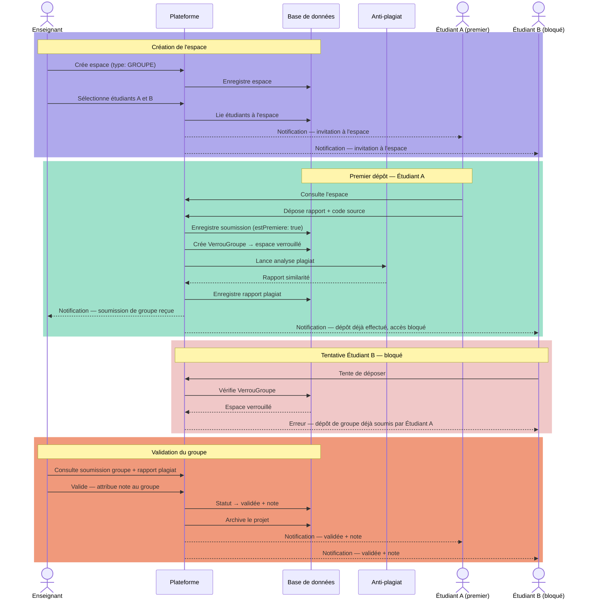

# 🔄 Séquence — Dépôt de Groupe

[← Back to Index](../index.md)

> The first student to submit locks the space. All other invited students are blocked and notified. The teacher reviews only the single group submission.

---

