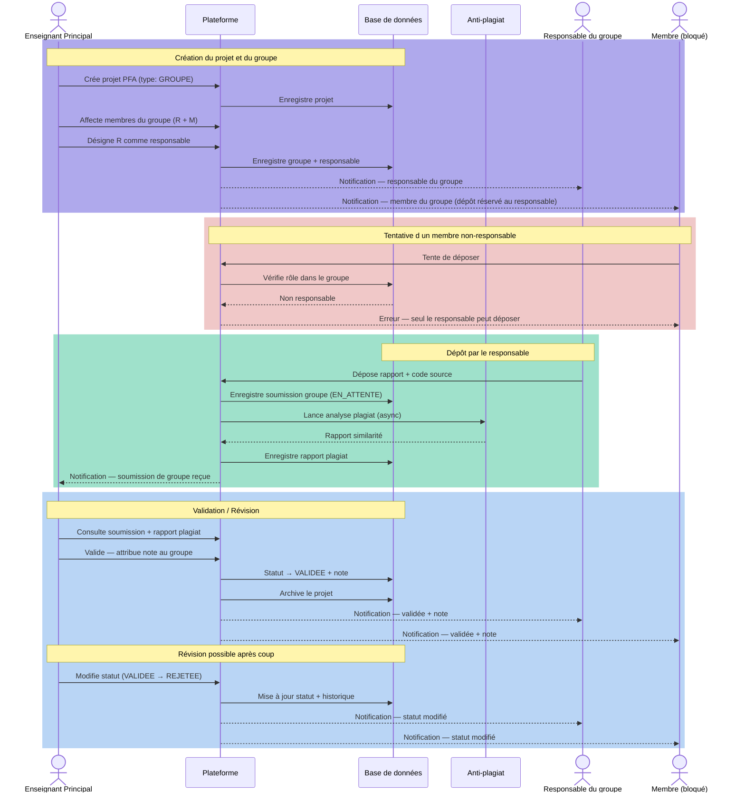

# 🔄 Séquence — Dépôt de Groupe

[← Retour à l'accueil](../index.md)

```mermaid
sequenceDiagram
    actor EP as Enseignant Principal
    participant P as Plateforme
    participant DB as Base de données
    participant AI as Anti-plagiat
    actor R as Responsable du groupe
    actor M as Membre (bloqué)

    rect rgb(175, 169, 236)
      note over EP,DB: Création du projet et du groupe
      EP->>P: Crée projet PFA (type: GROUPE)
      P->>DB: Enregistre projet
      EP->>P: Affecte membres du groupe (R + M)
      EP->>P: Désigne R comme responsable
      P->>DB: Enregistre groupe + responsable
      P-->>R: Notification — responsable du groupe
      P-->>M: Notification — membre du groupe (dépôt réservé au responsable)
    end

    rect rgb(240, 200, 200)
      note over M,P: Tentative d un membre non-responsable
      M->>P: Tente de déposer
      P->>DB: Vérifie rôle dans le groupe
      DB-->>P: Non responsable
      P-->>M: Erreur — seul le responsable peut déposer
    end

    rect rgb(159, 225, 203)
      note over R,DB: Dépôt par le responsable
      R->>P: Dépose rapport + code source
      P->>DB: Enregistre soumission groupe (EN_ATTENTE)
      P->>AI: Lance analyse plagiat (async)
      AI-->>P: Rapport similarité
      P->>DB: Enregistre rapport plagiat
      P-->>EP: Notification — soumission de groupe reçue
    end

    rect rgb(185, 213, 245)
      note over EP,DB: Validation / Révision
      EP->>P: Consulte soumission + rapport plagiat
      EP->>P: Valide — attribue note au groupe
      P->>DB: Statut → VALIDEE + note
      P->>DB: Archive le projet
      P-->>R: Notification — validée + note
      P-->>M: Notification — validée + note

      note over EP,DB: Révision possible après coup
      EP->>P: Modifie statut (VALIDEE → REJETEE)
      P->>DB: Mise à jour statut + historique
      P-->>R: Notification — statut modifié
      P-->>M: Notification — statut modifié
    end
```
