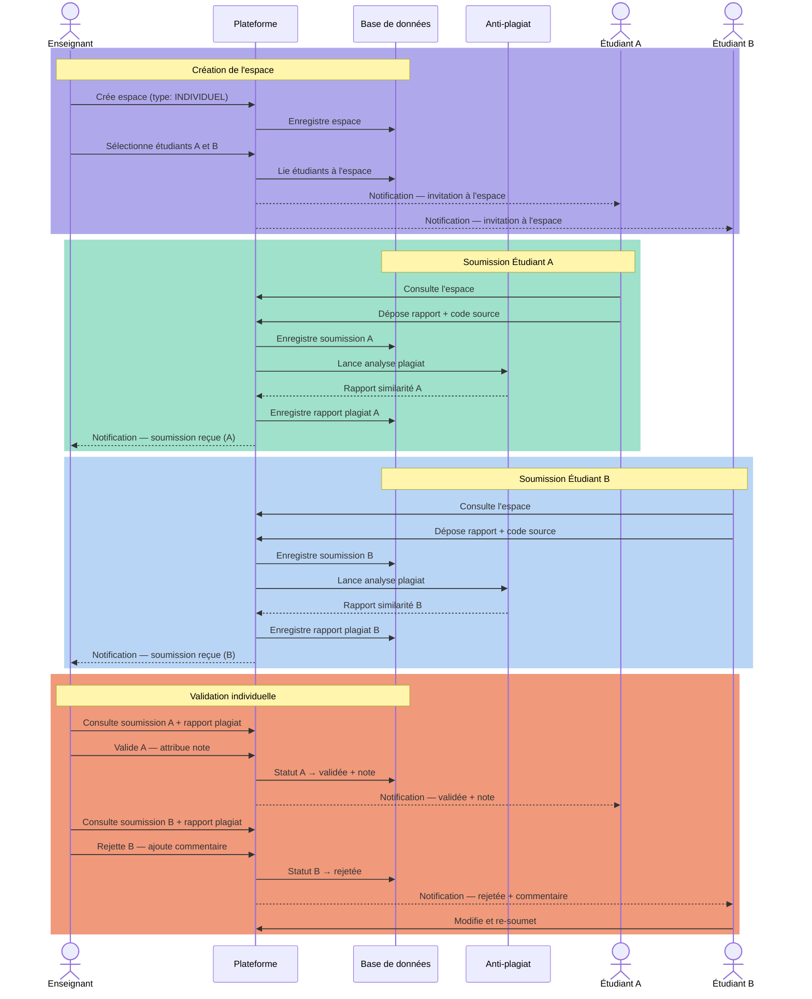

# 🔄 Séquence — Dépôt Individuel

[← Back to Index](../index.md)

> Each invited student submits their own deliverable independently. The teacher reviews and grades each one separately.

---

```mermaid
sequenceDiagram
    actor T as Enseignant
    participant P as Plateforme
    participant DB as Base de données
    participant AI as Anti-plagiat
    actor S1 as Étudiant A
    actor S2 as Étudiant B

    rect rgb(175, 169, 236)
      note over T,DB: Création de l'espace
      T->>P: Crée espace (type: INDIVIDUEL)
      P->>DB: Enregistre espace
      T->>P: Sélectionne étudiants A et B
      P->>DB: Lie étudiants à l'espace
      P-->>S1: Notification — invitation à l'espace
      P-->>S2: Notification — invitation à l'espace
    end

    rect rgb(159, 225, 203)
      note over S1,DB: Soumission Étudiant A
      S1->>P: Consulte l'espace
      S1->>P: Dépose rapport + code source
      P->>DB: Enregistre soumission A
      P->>AI: Lance analyse plagiat
      AI-->>P: Rapport similarité A
      P->>DB: Enregistre rapport plagiat A
      P-->>T: Notification — soumission reçue (A)
    end

    rect rgb(185, 213, 245)
      note over S2,DB: Soumission Étudiant B
      S2->>P: Consulte l'espace
      S2->>P: Dépose rapport + code source
      P->>DB: Enregistre soumission B
      P->>AI: Lance analyse plagiat
      AI-->>P: Rapport similarité B
      P->>DB: Enregistre rapport plagiat B
      P-->>T: Notification — soumission reçue (B)
    end

    rect rgb(240, 153, 123)
      note over T,DB: Validation individuelle
      T->>P: Consulte soumission A + rapport plagiat
      T->>P: Valide A — attribue note
      P->>DB: Statut A → validée + note
      P-->>S1: Notification — validée + note

      T->>P: Consulte soumission B + rapport plagiat
      T->>P: Rejette B — ajoute commentaire
      P->>DB: Statut B → rejetée
      P-->>S2: Notification — rejetée + commentaire
      S2->>P: Modifie et re-soumet
    end
```
