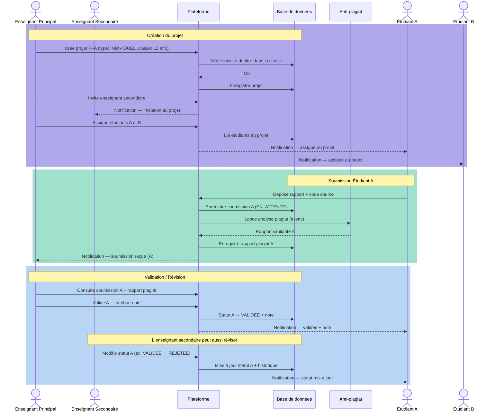

# 🔄 Séquence — Dépôt Individuel

[← Retour à l'accueil](../index.md)

```mermaid
sequenceDiagram
    actor EP as Enseignant Principal
    actor ES as Enseignant Secondaire
    participant P as Plateforme
    participant DB as Base de données
    participant AI as Anti-plagiat
    actor S1 as Étudiant A
    actor S2 as Étudiant B

    rect rgb(175, 169, 236)
      note over EP,DB: Création du projet
      EP->>P: Crée projet PFA (type: INDIVIDUEL, classe: L3 Info)
      P->>DB: Vérifie unicité du titre dans la classe
      DB-->>P: OK
      P->>DB: Enregistre projet
      EP->>P: Invite enseignant secondaire
      P-->>ES: Notification — invitation au projet
      EP->>P: Assigne étudiants A et B
      P->>DB: Lie étudiants au projet
      P-->>S1: Notification — assigné au projet
      P-->>S2: Notification — assigné au projet
    end

    rect rgb(159, 225, 203)
      note over S1,DB: Soumission Étudiant A
      S1->>P: Dépose rapport + code source
      P->>DB: Enregistre soumission A (EN_ATTENTE)
      P->>AI: Lance analyse plagiat (async)
      AI-->>P: Rapport similarité A
      P->>DB: Enregistre rapport plagiat A
      P-->>EP: Notification — soumission reçue (A)
    end

    rect rgb(185, 213, 245)
      note over EP,DB: Validation / Révision
      EP->>P: Consulte soumission A + rapport plagiat
      EP->>P: Valide A — attribue note
      P->>DB: Statut A → VALIDEE + note
      P-->>S1: Notification — validée + note

      note over ES,DB: L enseignant secondaire peut aussi réviser
      ES->>P: Modifie statut A (ex. VALIDEE → REJETEE)
      P->>DB: Mise à jour statut A + historique
      P-->>S1: Notification — statut mis à jour
    end
```
